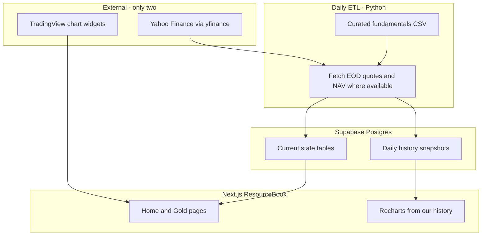

# ResourceBook — Detailed MVP Plan

**Product:** ResourceBook  
**Status:** Planning complete — ready to build MVP  
**Last updated:** 2026-08-22

This document is the source of truth for the Gold Hub MVP dashboard. Earlier brainstorm notes live in `README.md`, `Resource Book Requirements.docx`, and `Page by Page plan for each commodities.xlsx`.

---

## 1. Locked decisions

| Decision | Choice |
| --- | --- |
| Scope | Gold Hub deep-build + multi-commodity nav shell (other hubs as placeholders) |
| Theme | System preference + manual light/dark toggle |
| Entry | Real site Home at `/` (not redirect-only to `/gold`) |
| Physical page | Metal / bullion ETFs & trusts (own the metal) + dealers by location; MVP markets: **Canada (CAD)** and **USA (USD)** via country/currency filter |
| Companies page | Equities by Lassonde tier **plus gold miner ETFs** (US/CA majors and juniors) — not physical-metal funds |
| Nav | Top commodities; click = hub home; hover = simple single-list page menu |
| Charts | TradingView widgets only (interactive price charts) |
| Market data | Yahoo Finance (`yfinance`) daily into Supabase — one quote source |
| History | Daily snapshots in Supabase so metrics (e.g. price-to-NAV) can be charted over time |
| Why Gold | Section on `/gold` Overview for MVP (own `/gold/why` route later if needed) |
| Default Physical market | **USA (USD)**; one-click switch to Canada (CAD) |
| Auth | Fully public; no login for MVP |
| Disclaimer | One footer line (“not investment advice”); full legal pages later |
| Seed data | Curated starter CSV during build; editable by hand |
| Missing NAV | Show price always; show premium/discount only when `nav_per_share` is present |
| ETL runtime | Python scripts in `/scripts` (manual or cron / GitHub Action) — not inside Next.js requests |

---

## 2. Data architecture (two external sources)

| Role | Source | Cost |
| --- | --- | --- |
| Interactive price charts | TradingView free widgets | $0 |
| Quotes, EOD prices, basic ETF/equity fields | Yahoo via `yfinance` (daily ETL) | $0 |
| Mining fundamentals (AISC, NPV, tiers, assays) | Curated CSV / manual seed (Gemini later) | $0 |
| Analytical charts over time (NAV premium, AISC trends) | **Supabase history we accumulate** | $0 |

No FMP / Polygon / Alpha Vantage required for MVP. If Yahoo becomes unreliable later, swap the ETL adapter; the schema stays the same.

**TradingView:** charts users interact with (spot, ticker OHLC). We do not scrape TradingView into the DB.

**Yahoo daily ETL:** upserts current rows **and appends a history row** each day. That history powers premium/discount over time and similar series.

**Do not** store sub-second ticks. Daily (or a few times per day) is enough for an analytical platform.

### What lands in the DB each day

- Spot / commodity closes + 52w high/low + gold/silver ratio
- Equity and ETF: price, market cap, daily % change
- Metal ETF/trust: market price, NAV (when available), computed premium/discount %
- Rankings from that close (movers, AISC board using latest spot)
- Fundamentals: only when CSV / Gemini updates (not every day)

### Historical analytics (first-class)

- Price vs NAV / premium-discount series per trust
- Optional spot history for margin math
- Company metric points when they change (AISC, reserves) with `as_of` dates
- Later: `quarterly_metrics` from Gemini

UI charts for these series use **Recharts (or similar) reading Supabase** — not TradingView.

---

## 3. Information architecture

### Global shell

- **Brand:** ResourceBook
- **Header:** Logo left · commodity links center · theme toggle right
- **Commodities:** Gold | Silver | Copper | Uranium | Oil | Gas | Battery Metals
- **Theme:** `prefers-color-scheme` default; user override in `localStorage`

### Commodity nav behavior

- **Click** commodity name → hub home (e.g. `/gold`)
- **Hover** (desktop) / expand (mobile) → **one simple list** of that hub’s pages (not a 3-column mega-menu)

**Gold dropdown (MVP):**

1. Overview — `/gold`
2. Physical (Metal ETFs & Dealers) — `/gold/physical`
3. Companies (Equities & Miner ETFs) — `/gold/companies`

**Non-gold:** same labels; destinations are stubs (“Coming soon”) except Overview stub.

AISC leaderboard and top movers are **sections on Overview**, not separate nav items.

### Route map (MVP)

| Route | Status |
| --- | --- |
| `/` | Build — site Home |
| `/gold` | Build — macro overview (includes Why Gold section) |
| `/gold/physical` | Build — metal ETFs + dealers, CA/US filter, NAV history |
| `/gold/companies` | Build — Lassonde equities + miner ETFs |
| `/gold/companies?tier=` | Same page, tab/query filter |
| `/gold/[ticker]` | Build — equity, metal ETF, or miner ETF detail |
| `/silver`, `/copper`, … | Stub shells only |
| `/about` or legal | Defer (footer disclaimer only) |

---

## 4. Page specs

### 4.1 Site Home — `/`

**Job:** Sell the thesis and route into hubs — not a dense dashboard.

**First viewport**

- Brand mark + name (hero-level)
- One headline (hard assets / natural resources, modern analytics)
- One supporting sentence (why fragmented SEDAR-era tools fail retail/macro investors)
- CTA: **Explore Gold** (primary) · secondary link to how the risk curve works
- Dominant visual plane (not a card grid of stats)

**Below fold**

1. Why own natural resources (short)
2. How we organize the market (hubs × Lassonde curve)
3. What’s live now — Gold featured; others “next”
4. Minimal footer + disclaimer

### 4.2 Gold Overview — `/gold`

**Job:** Macro + narrative gateway.

- **Stats bar** (Supabase current row from Yahoo ETL): spot, 24h change, 52-week range, gold/silver ratio when available
- **Main chart:** TradingView gold spot / futures embed
- **Why Gold / tailwinds:** cards — CB accumulation, deficits, geopolitics, real rates
- **Supply/demand preview:** light editorial; full specialty later
- **Leaderboards (DB):** top movers; top 5 AISC producers → Companies filter

### 4.3 Physical metal exposure — `/gold/physical`

**Job:** Physical gold exposure — metal-backed ETFs/trusts and vetted dealers — filtered by market.

**Split vs Companies:** this page is only vehicles that track/own **physical metal**. Miner equity ETFs live on `/gold/companies`.

**Country / currency control**

- Control: **Canada — CAD** | **USA — USD** (default **USA — USD**)
- Filters both: metal ETFs/trusts for that market, and dealers by location

**Section A — Metal ETFs & physical trusts**

| Column | Notes |
| --- | --- |
| Ticker | Exchange-appropriate symbol |
| Fund name | |
| Market price | In selected currency where possible |
| NAV / share | When available |
| Premium/discount % | Only when NAV present |
| Expense ratio | |
| Vault / custodian | |
| Country / currency | `US`/`CA`, `USD`/`CAD` |

**Illustrative seed (finalize in CSV):**

- USA / USD: GLD, IAU, GLDM, IAUM, PHYS
- Canada / CAD: Canadian-listed physical gold ETFs/trusts (curate TSX tickers in seed)

**Analytics:** premium/discount history from `vehicle_daily`, scoped to the filtered set.

**Section B — Dealers by location**

- Curated directory (seeded, not scraped): name, website, country, regions served, notes
- Same CA/US filter
- Plain outbound links for MVP (affiliates later)
- Small trusted list (quality over quantity)

### 4.4 Companies & miner ETFs — `/gold/companies`

**Job:** Equities along the Lassonde curve **and** gold **miner** ETFs (sector beta — not physical metal).

**Tabs:** All | Royalty & Streaming | Producers | Developers | Explorers | **Miner ETFs**

**Miner ETFs (illustrative — confirm in seed):**

- US: GDX, GDXJ, plus one junior/explorer-oriented pick if desired
- Canada: TSX/TSXV gold miner / junior ETF products

Optional secondary filter on Miner ETFs tab: listing country (US / CA).

**Equity columns:** ticker, name, market cap, price, 24h %, AISC, AISC margin (spot − AISC), jurisdiction, reserves; developers add stage / NPV / IRR; explorers add runway / assays.

**Miner ETF columns:** ticker, name, country/currency, price, AUM, expense ratio, 24h %, holdings blurb — not AISC at fund level.

### 4.5 Ticker detail — `/gold/[ticker]`

Header + TradingView symbol chart + tier-aware metric grid.

For metal trusts: current NAV metrics **plus** premium/discount history from Supabase.

Filings / Gemini timeline: stub until Phase 1.5.

### 4.6 Commodity stubs

Same header + simple dropdown; body: coming soon + CTA to Gold / Home.

---

## 5. Data model (history-aware)

### Current state

- `commodities` — symbol, name, price, change_24h, high_52wk, low_52wk, updated_at
- `vehicles` — metal ETFs/trusts: ticker, commodity_id, name, market_price, nav_per_share, expense_ratio, vault_location, country (`US`|`CA`), currency (`USD`|`CAD`), exchange
- `companies` — equities: tier `royalty|producer|developer|explorer`, fundamentals; optional listing country
- `miner_etfs` (or `companies` with `tier = 'miner_etf'`) — ticker, name, country, currency, price, aum, expense_ratio, metadata
- `dealers` — name, url, country, regions_served, notes, active (curated seed; no Yahoo)

### History (required for MVP analytics)

- `vehicle_daily` — `(ticker, as_of_date)` PK; market_price, nav_per_share, premium_discount_pct, source
- `commodity_daily` — `(symbol, as_of_date)` PK; price, change_24h
- `company_daily` — `(ticker, as_of_date)` PK; price, market_cap, change_pct

### Later

- `quarterly_metrics` — Gemini extractions
- `content_cards` — narrative copy

**RLS:** public read; ETL writes with service role.

---

## 6. Frontend stack & UI rules

- Next.js App Router, TypeScript, `src/`, Tailwind, lucide-react, Supabase
- Server Components by default; client for theme, hover nav, table sort, embeds
- TradingView embeds for market price charts
- Recharts (or similar) for **our** history series (NAV premium, AISC boards)
- Light + dark tokens; Home brand-first; screeners denser

---

## 7. Build order

1. ~~Scaffold — theme, header, click + simple hover dropdown, stubs~~ **Done (2026-08-25)** — see `docs/BUILD_LOG.md`
2. Supabase schema — current + daily history tables + gold seed CSV
3. Home `/` polish (content already scaffolded; iterate with design)
4. `/gold` overview — stats, TradingView, narrative, leaderboards
5. `/gold/physical` — CA/US filter, metal ETF table, dealers, history chart
6. `/gold/companies` — Lassonde tabs + Miner ETFs tab
7. `/gold/[ticker]`
8. Daily Yahoo ETL — upsert current + insert history
9. Commodity stubs polish
10. Empty states, mobile nav, SEO, footer disclaimer

**Phase 1.5:** Gemini quarterly PDFs, richer macro series, equity-vs-spot overlay, first non-gold hub. Paid quote API only if Yahoo fails in production.

---

## 8. Accounts needed to start

- GitHub repo (this repo)
- Free Supabase project
- No paid market-data APIs for MVP

---

## 9. Success criteria for MVP

- Click Gold → Overview; hover Gold → simple page list
- TradingView charts on Overview and ticker pages
- Yahoo daily job updates prices **and** appends history
- Physical page: Canada (CAD) / USA (USD) filter drives metal ETFs **and** dealers
- Physical page: current premium/discount (when NAV exists) **and** history chart from Supabase
- Companies page: Lassonde equities **plus** miner ETFs (US and Canada)
- Non-gold nav does not 404
- Public site with footer disclaimer; no auth
- No multi-provider API sprawl; no tick-level DB writes
